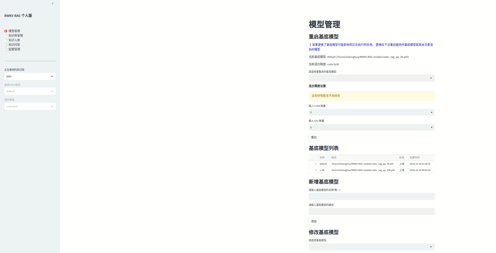
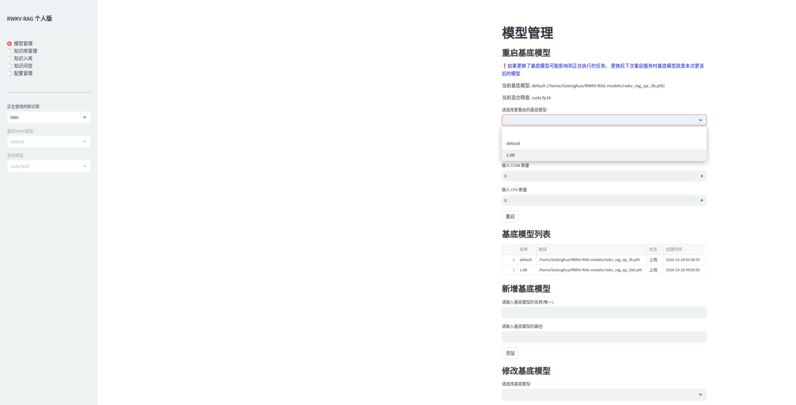

# RWKV-RAG-Personal  

RWKV-RAG-Personal 是RWKV-RAG 个人版，它是一个基于 RWKV 模型的一键 RAG 部署系统，可轻松搭建和管理本地知识库，同时提供了基于本地知识库的问答机器人（RWKV-RAG-CHAT）。


## 特性

- **💻 带图形化界面：** RWKV-RAG-Personal 的主要功能都有提供直观且易于操作的用户体验
- **⛓️ 配置简单：** RWKV-RAG-Personal 配置简单，没有太多的配置参数
- **🎛️ 兼容性:** RWKV-RAG-Personal 兼容Linux和Windows系统


## 模型下载

完整的 RWKV-RAG-Personal 服务需要以下模型文件，请将以下模型下载到工作区：

- 下载 RWKV base model（基底模型）：[HuggingFace下载地址](https://huggingface.co/SupYumm/rwkv6_rag_qabot/tree/main)
- 下载 BGEM3 重排序模型（rerank model）：[HuggingFace下载地址](https://huggingface.co/BAAI/bge-reranker-v2-m3)  [modelscope下载地址](https://modelscope.cn/models/BAAI/bge-reranker-v2-m3)
- 下载 BGEM3 Embedding 模型: [[HuggingFace下载地址](https://huggingface.co/BAAI/bge-m3)   [modelscope下载地址](https://modelscope.cn/models/BAAI/bge-m3)

> [!TIP]  
> 
> 建议模型文件放在同一个文件夹，便于管理，如下图示例所示。
> 
> 
>
> 请确认设备 VRAM 并选择一个合适的 RWKV 模型作为 RWKV-RAG-Personal 系统。以下是各参数 RWKV 模型的**推理 VRAM 需求**:
> 
> | SIZE        | VRAM |
> -------------|-----
> | RWKV-6-1B6  | 4G   |
> | RWKV-6-3B   | 7.5G |
> | RWKV-6-7B   | 18G |
> | RWKV-6-12B  | 24G|
> |  RWKV-6-14B |30G|
> 


目前 BGEM3 更适合作为 RWKV-RAG-Personal 系统的 rerank 和 embedding 模型。我们也在开发性能更强的 RWKV embedding 和 rerank 模型，以替换掉 BGEM3 模型。

## 下载和安装

> [!TIP]
> 
> 开始下载安装之前，确保系统已经安装Python3.10、NVIDIA驱动、CUDA12.1+


### 1. 克隆 RWKV-RAG-Personal 仓库

```
git clone https://github.com/AIIRWKV/RWKV-RAG-Personal.git
```

### 2. 安装依赖项
   
进入到项目目录，安装Python依赖

##### Linux

```shell
pip3 install -r requirements.txt 
```

> [!WARNING]
> 
> Linux 系统安装torch==2.2.2时，默认安装GPU版，如果在该Python环境下执行torch.cuda.is_available()返回的False，说明安装的是CPU版本，这时建议单独安装torch
> ```shell
> pip3 install torch==2.2.2  --index-url https://download.pytorch.org/whl/cu121
>```


##### Windows

```shell
pip3.exe install -r requirements.txt
```

> [!WARNING]
> 
> Windows 系统安装torch==2.2.2时，默认安装CPU版，如果在该Python环境下执行torch.cuda.is_available()返回的False，说明安装的是CPU版本，这时建议单独安装torch
> ```shell
> pip3.exe install torch==2.2.2  --index-url https://download.pytorch.org/whl/cu121
>```
> 

安装完依赖项后，需要为```playwright```安装浏览器驱动。

##### Linux

```shell
playwright install
playwright install-deps
``` 

##### Windows

```shell
playwright.exe install
playwright.exe install-deps
```

> [!WARNING]  
> 
> 对于部分Linux操作系统，在联网检索知识时，```playwright```运行报错的话，可能还需要更新系统组件。
> ```shell
> sudo apt-get update
> sudo  apt-get install libnss3  \
>   libnspr4  \
>   libdbus-1-3 \
>   libatk1.0-0  \
>   libatk-bridge2.0-0  \
>   libcups2  \
>   libdrm2  \
>   libatspi2.0-0  \
>   libxcomposite1  \
>   libxdamage1 \
>   libxfixes3  \
>   libxrandr2 \
>   libgbm1  \
>   libxkbcommon0 \
>   libasound2
>```
> 


对于入库文件是图片格式的PDF文件，需要额外安装```tesseract```和中文语言包

##### Linux
```shell
sudo apt-get install tesseract-ocr
tesseract -v  # 查看版本
```
如果能输出```tesseract```版本号，说明安装成功。然后继续安装中文语言包
```shell
sudo apt-get install tesseract-ocr-chi-sim
tesseract --list-langs  # 查看已安装语言包
```
如果输出有chi_sim，说明中文语言包安装成功。

##### Windows
- ```tesseract```[下载页面](https://digi.bib.uni-mannheim.de/tesseract/)根据电脑系统选择合适的exe安装包进行安装，并将安装路径(默认路径 ```C:\Program Files\Tesseract-OCR\tessdata```)添加到系统环境
- 安装完成之后，直接在cmd输入： ```tesseract -v```，如果能输出```tesseract```版本号，说明安装成功；如果提示命令不存在，那可能是没有将安装路径添加到系统环境变量中，可自行搜索如何添加环境变量。
- 在[语言包页面](https://github.com/tesseract-ocr/tessdata) 选择```chi_sim.traineddata```，然后下载并复制到安装路路里，即与```eng.traineddata```(默认会安装此语言包)同级目录。
- 在cmd输入： ```tesseract --list-langs```，如果能输出chi_sim，说明中文语言包安装成功。


### 3. 修改配置文件

可以通过修改项目配置文件 `ragq.yml` 修改配置参数，配置参数含义如下：

##### 模型相关参数
- **base_model_path**: RWKV 基底模型的路径，请参考 [RWKV 模型下载](https://rwkv.cn/RWKV-Fine-Tuning/Introduction#%E4%B8%8B%E8%BD%BD%E5%9F%BA%E5%BA%95-rwkv-%E6%A8%A1%E5%9E%8B) 
- **embedding_path**: 嵌入模型的路径，推荐使用: bge-m31
- **reranker_path**: 重排序模型的路径，推荐使用: BAAIbge-reranker-v2-m3

##### 数据库相关参数

- **vectordb_name**: 向量数据库名词，目前已集成如下向量数据库：
  - **Linux**：chromadb,milvus Lite版
  - **Windows**: chromadb
  
  > [!WARNING]
  > 
  > 默认使用的是chromadb，如果要使用其它向量数据库请先安装相关Python包
  > 
- **vectordb_path**: 向量数据库存放数据路径，确保路径是存在的
- **vectordb_port**: 向量数据库服务端口
- **vectordb_host**: 向量数据库服务地址，该项目运行时在本地会启动向量数据库服务，所以可填```localhost```、```127.0.0.1```,默认值```localhost```
- **sqlite_db_path**: SQLite 数据库存放数据位置，确保所填写的文件路径对应的文件夹存在。

##### 其它参数
- **knowledge_base_path**: 知识库路径，用于存放知识库文件。
- **strategy**: 混合精度，默认是空，对应的精度是cuda fp16，没有特殊场景需求，不需要修改该值。
- **is_init**: 布尔类型，该值为```false```时，项目启动时会优先进入安装指引页面，在该页面修改配置参数并保存后，刷新页面会加载模型并运行；为```true```时不会进入安装指引界面，这时需要用户自行修改```ragq.yml```文件里的参数并确保参数合法。


### 4. 启动服务

RWKV-RAG-Personal目前是使用streamlit框架开发WebUI客户端，启动命令如下：

```shell
streamlit run client.py
```
在浏览器中打开 Streamlit 提供的 URL，应当可以看到如下界面：



至此， RWKV-RAG-Personal 服务已成功启动，可以在 WebUI 客户端中体验知识库管理、问答机器人等功能。


## RWKV-RAG-Personal 功能指引

### 模型管理
模型管理界面用于管理 RWKV-RAG-Personal 系统的基底模型。支持对基底模型进行添加、修改、上线、下线和重启等操作。

> [!TIP]  
> 
> 上线状态的模型才能被使用；下线状态的模型不能被使用。
> 
> 重启模型时会影响到正在执行的任务；模型重启后，如果不更改配置文件的基底模型参数base_model_path的值，则后续重启服务时都是用本次更改后的模型作为默认基底模型。



### 知识库管理

知识库管理界面用于管理存储在 ChromaDB 数据库中的知识库，一个collection就是一个知识库，服务启动时默认都会创建一个名为initial的知识库。支持对知识库进行新增、删除和查询知识库内容等操作。

> [!TIP]  
> 
> 由于Streamlit架构的限制，新增、删除知识库后，建议刷新 Web 页面同步最新改动。


---

### 知识入库

知识入库界面用于将文本内容**分块索引**到现有的知识库中，已入库的知识可以被检索，用于问答机器人或其他下游服务。

RWKV-RAG-Personal 支持两种不同的知识入库方法，这些方法支持解析 TXT、PDF和Excel 三种文件格式：

- **手动输入：** 在输入框中手动输入或粘贴文本内容，系统会按行对文本进行Chunking（**分块**）
- **本地文件：** 如果你需要将电脑本地**某个文件**或者**某个目录**下所有文件的内容加入知识库，填写文件或者目录的路径，系统会按照固定长度和块重叠字符数对文件进行Chunking（**分块**）


> [!WARNING]  
> 
> 支持文本格式或图片格式的PDF文件入库，但是需要提前安装**tesseract**，并需要安装中文语言包(**chi_sim**)

> [!TIP]  
> 
> RWKV-RAG-Personal 支持从互联网上搜索知识，并将搜索到的知识文本以 TXT 格式保存到**电脑本地的指定目录**。
>
> **联网搜索得到的 txt 文本文件仍然需要进行知识入库，才能加入现有知识库中。**


---

### 知识问答机器人

RWKV-RAG-Personal 系统提供基于知识库的问答机器人（RWKV-RAG-CHAT）。用户可以从现有的知识库中检索特定主题的知识，然后利用提取到的知识与模型进行聊天，以增强模型的回答效果。

RWKV-RAG-CHAT 的工作流程如下：

1. **输入查询内容，点击 “召回” 按钮**

2. **RWKV-RAG-Personal 从知识库中提取最相关的知识（文本块）**

3. **rerank 模型对提取出来的文本块进行匹配度打分，选出最佳匹配知识**

4. **在底部输入框中输入问题并点击 “发送” 按钮，与模型聊天**


## 未来计划

- 以 ASR 和视觉为主的多模态框架将很快上线。此外，GraphRAG 和提示优化也在开发中。
- 用更专业的前端技术重构UI界面。
- 集成全新的一键微调功能。

## Acknowledgement
- 所有 RWKV 模型来自 [@BlinkDL](https://github.com/BlinkDL) 的 [RWKV-LM ](https://github.com/BlinkDL/RWKV-LM)项目
- 项目作者：[YYnil](https://github.com/yynil) ; [Ojiyum](https://github.com/Ojiyumm) ;  [LonghuaLiu](https://github.com/Liu3420175)


